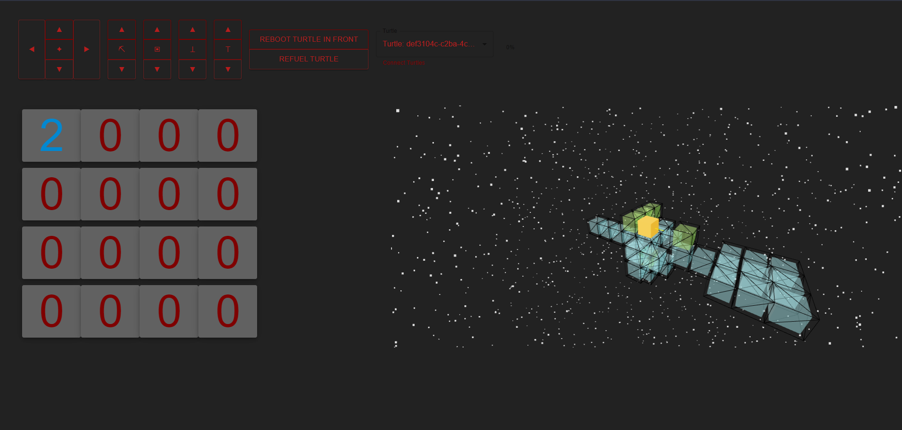
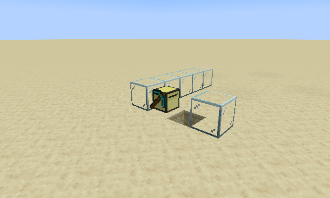

# Requirements
- ngrok
- node

# Setup
- WINDOWS run "ngrok http 43509" from a cmd in the directory of turtle-server
- WSL Install ngrok [here](https://gist.github.com/SalahHamza/799cac56b8c2cd20e6bfeb8886f18455)
    - From your root directory (Or where ever you decide to install ngrok) run "./ngrok http 43509"
- add the forwarding url to the turtles websocket route but replace http:// with ws:// (Line 3 of the remote.lua, the one that is on the turtle, not in this directory)
- To start up the back end servers, change your current directory to turtle-server
    - Then run `npm i` then `npm start`
- Open a seperate terminal and direct it to turtle-ui, then run `npm i`
- open the react app in turtle-ui-web with `npm start` (must have current directory in turtle-ui)
- The version of CC:Tweaked that this was made for was Minecraft version 1.18.2
- Once in your minecraft world with CC:Tweaked running, you need to create a [Satalite](https://www.youtube.com/watch?v=0_5W0gcZD8I)
- For the turtle that runs best, get an advanced mining turtle AND a wireless modem
- place down a turtle and put the wireless modem in the highlighted slot of the turtles inventory
- run these commands in a row 
    - `lua` 
    - `turtle.equipLeft()`
    - `exit()`
    - `pastebin get DcyQDBWF startup`
    - `pastebin get 4nRg9CHU json`
- then reboot the turtle, using the power switch on the left side of the turtles interface.
- Open up the react app and you should be able to controll the turtle. DO NOT FORGET TO FUEL THE TURTLE
- You can test fuel by checking if the turtle spins. If it spins but does not move then you are connected and out of fuel

# Debug
- If it isnt working, ensure that in the backend terminal you see {wData: "connected"}, if you do not, you need to refresh the website.
- If no turtles are listed on the website, refresh the website IF the turtles are on. If the turtles are off you need to turn it on in game.

# App work flow
- React app handles the creating of commands for, gathering data from, and sending incoming data to the Json Database
- Turtles are very slow and have very limited storage and computing power so it is handed off almost entirely to the app.
- Communication is maintained via a websocket server.
- Multible websocket connections are possible due to Ngrok.

# Media

